# Cobblemon IV Candy

A Minecraft mod that extends the [Cobblemon](https://cobblemon.com/) mod by adding an Individual Values (IV) enhancement system through craftable candies and shards.

## 📖 Documentation

**[📚 Visit the Complete Wiki](https://psbds.github.io/cobblemon-iv-candy/)**

The full documentation includes:
- **[Installation Guide](https://psbds.github.io/cobblemon-iv-candy/installation/)** - Step-by-step setup
- **[Items Reference](https://psbds.github.io/cobblemon-iv-candy/items/)** - Complete item documentation
- **[Crafting Recipes](https://psbds.github.io/cobblemon-iv-candy/recipes/)** - All crafting patterns
- **[Commands](https://psbds.github.io/cobblemon-iv-candy/commands/)** - Administrative commands
- **[Compatibility](https://psbds.github.io/cobblemon-iv-candy/compatibility/)** - Version compatibility info
- **[Development Guide](https://psbds.github.io/cobblemon-iv-candy/development/)** - For contributors

## ✨ Features

### 🔮 IV Shards System
- Collect shards from defeated Pokémon, which you can use to make IV Candies
   -  
      **Species IV Shard**: Dropped by any non legendary, mythical, ultrabeast or paradox Pokémon
   - **Elemental IV Shards**:
      -  **Fire**: Dropped by Fire-type Pokémon
      -  **Water**: Dropped by Water-type Pokémon
      -  **Grass**: Dropped by Grass-type Pokémon
      -  **Electric**: Dropped by Electric-type Pokémon
      -  **Ice**: Dropped by Ice-type Pokémon
      -  **Rock**: Dropped by Rock-type Pokémon
      - 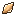 **Ground**: Dropped by Ground-type Pokémon
      -  **Flying**: Dropped by Flying-type Pokémon
      -  **Psychic**: Dropped by Psychic-type Pokémon
      -  **Bug**: Dropped by Bug-type Pokémon
      -  **Poison**: Dropped by Poison-type Pokémon
      -  **Fighting**: Dropped by Fighting-type Pokémon
      -  **Ghost**: Dropped by Ghost-type Pokémon
      -  **Dragon**: Dropped by Dragon-type Pokémon
      -  **Dark**: Dropped by Dark-type Pokémon
      -  **Steel**: Dropped by Steel-type Pokémon
      -  **Fairy**: Dropped by Fairy-type Pokémon
      -  **Normal**: Dropped by Normal-type Pokémon
   
   - **Special IV Shards**:
      -  **Legendary** - Dropped by Legendary Pokémon
      -  **Mythical** - Dropped by Mythical Pokémon
      -  **Ultra Beast** - Dropped by Ultra Beast Pokémon
      - 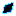 **Paradox** - Dropped by Paradox Pokémon


### 🍬 IV Candy System
- Craft targeted IV candies for specific stats (HP, Attack, Defense, etc.) or Random IV candies for general improvements

   - 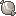 
      **Species IV Candy**: Crafted by using  Species IV Shards
   - **Elemental IV Candys**:
      -  **Fire**: Crafted using  Fire IV Shards
      -  **Water**: Crafted using  Water IV Shards
      - 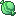 **Grass**: Crafted using  Grass IV Shards
      - 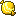 **Electric**: Crafted using  Electric IV Shards
      -  **Ice**: Crafted using  Ice IV Shards
      - 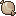 **Rock**: Crafted using  Rock IV Shards
      - 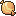 **Ground**: Crafted using  Ground IV Shards
      -  **Flying**: Crafted using  Flying IV Shards
      - 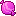 **Psychic**: Crafted using  Psychic IV Shards
      - 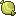 **Bug**: Crafted using  Bug IV Shards
      -  **Poison**: Crafted using  Poison IV Shards
      - 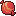 **Fighting**: Crafted using  Fighting IV Shards
      - 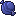 **Ghost**: Crafted using  Ghost IV Shards
      -  **Dragon**: Crafted using  Dragon IV Shards
      -  **Dark**: Crafted using  Dark IV Shards
      -  **Steel**: Crafted using  Steel IV Shards
      -  **Fairy**: Crafted using  Fairy IV Shards
      -  **Normal**: Crafted using  Normal IV Shards
   
   - **Special IV Candys**:
      -  **Legendary** - Crafted using  Legendary IV Shards
      - 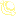 **Mythical** - Crafted using  Mythical IV Shards
      - 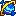 **Ultra Beast** - Crafted using  Ultra Beast IV Shards
      -  **Paradox** - Crafted using  Paradox IV Shards

### ⚡ Smart Stat Enhancement
- When crafting your IV Candies, you can choose between spending less shards to get a random IV or use more to set the IV of your choice

#### Random IV Crafting
   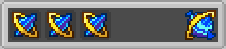

#### Target IV Crafting
   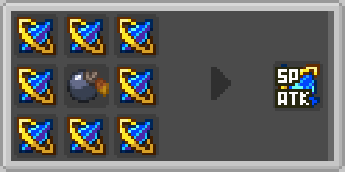

   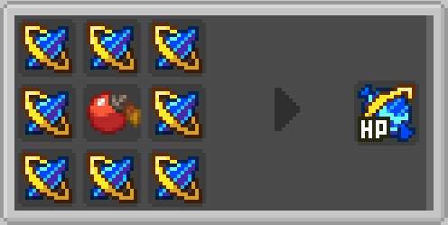

Check  **[Crafting Recipes](https://psbds.github.io/cobblemon-iv-candy/recipes/)** for all crafting patterns

## 🚀 Quick Start

1. **Install Prerequisites:**
   - Minecraft 1.21.1
   - Fabric Loader 0.16.5+
   - Fabric API 0.104.0+1.21.1
   - Cobblemon 1.6.0+1.21.1-SNAPSHOT

2. **Download and Install:**
   - Download the latest release from [GitHub Releases](https://github.com/psbds/cobblemon-iv-candy/releases)
   - Place the `.jar` file in your `mods` folder
   - Start Minecraft with the Fabric profile

3. **Start Playing:**
   - Defeat Pokémon to collect IV Shards
   - Craft IV Candies using the recipes
   - Use candies on your Pokémon to enhance their IVs

## 📋 Requirements

| Component | Version | Status |
|-----------|---------|--------|
| **Minecraft** | 1.21.1 | Required |
| **Fabric Loader** | 0.16.5+ | Required |
| **Fabric API** | 0.104.0+1.21.1 | Required |
| **Cobblemon** | 1.6.0+1.21.1-SNAPSHOT | Required |
| **Fabric Language Kotlin** | 1.12.3+kotlin.2.0.21 | Recommended |

## 🏗️ Building from Source

```bash
# Clone the repository
git clone https://github.com/psbds/cobblemon-iv-candy.git
cd cobblemon-iv-candy

# Build the mod
./gradlew build  # On Windows: .\gradlew.bat build

# Find the built mod in src/build/libs/
```

For detailed development instructions, see the [Development Guide](https://psbds.github.io/cobblemon-iv-candy/development/).

## 🤝 Contributing

We welcome contributions! Please:

1. Read the [Development Guide](https://psbds.github.io/cobblemon-iv-candy/development/)
2. Fork the repository
3. Create a feature branch
4. Make your changes
5. Test thoroughly
6. Submit a pull request

## 📝 License

This project is licensed under the MIT License - see the [LICENSE](LICENSE) file for details.

## 🔗 Links

- **[📚 Complete Wiki](https://psbds.github.io/cobblemon-iv-candy/)** - Full documentation
- **[🐛 Report Issues](https://github.com/psbds/cobblemon-iv-candy/issues)** - Bug reports and feature requests
- **[🌐 Cobblemon Website](https://cobblemon.com/)** - Main Cobblemon mod