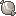
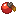
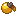
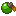
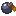
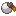
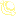
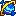
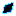

# How to Play
{: .no_toc }

## Table of contents
{: .no_toc .text-delta }

1. TOC
{:toc}

---

## The gameplay loop

1. **🔥 Battle Pokémon** → Defeat wild Pokémon
2. **💎 Collect Shards** → Shards drop based on the defeated Pokémon's characteristics
3. **⚒️ Craft Candies** → Use shards with other ingredients to create IV Candies
4. **🍬 Enhance Pokémon** → Use candies on your Pokémon to improve their IVs
5. **📈 Repeat Process** → Continue to maximize your Pokémon's potential

## Core Concepts

### Items

The Cobblemon IV Candy mod introduces two main categories of items that work together to provide a comprehensive IV enhancement system for your Pokémon.

####  [IV Shards](../shards/)
{: .no_toc }
IV Shards are the **raw materials** used to craft IV Candies. They are obtained when Wild Pokémon faint or are captured and serve as the foundation for the candy crafting system. The shards can be of the following types:

- **Species Shards**: Specific to individual Pokémon species
- **Elemental Shards**: Based on the 18 Pokémon types
- **Special Shards**: From Legendary, Mythical, Ultra Beast, and Paradox Pokémon

[Learn more about IV Shards →](../shards/)

####   [IV Candies](../candies/)
{: .no_toc }
IV Candies are **consumable items** that enhance a Pokémon's Individual Values when used. They are crafted from IV Shards using specific recipes. Like shards, candies can have the following types:

- **Species Candies**: Specific to individual Pokémon species
- **Elemental Candies**: Based on the 18 Pokémon types
- **Special Candies**: From Legendary, Mythical, Ultra Beast, and Paradox Pokémon

Also, the candy have an additional property regarding which IV it's going to increase
- **Targeted Candies**: Improve specific IV stats (HP, Attack, Defense, etc.)
- **Random Candies**: Improve a random non-maxed IV stat

[Learn more about IV Candies →](../candies/)

### Recipes

Crafting IV Candies requires combining IV Shards with other materials. There are two main recipe types:

#### Basic Candy Recipe (Random IV)
Creates candies that improve a random non-maxed IV stat.

  <!-- 3x3 Crafting Grid -->
  

    <!-- Row 1 -->
    

      
    

    

      
    

    

      
    

    <!-- Row 2 -->
    

    

    

    

    

    

    <!-- Row 3 -->
    

    

    

    

    

    

  

  
  <!-- Arrow -->
  
→

  
  <!-- Result -->
  

    
  

**Result:** Random IV Candy that works on compatible Pokémon

#### Super Candy Recipe (Targeted IV)
Creates candies that improve a specific IV stat of your choice.

**Stat Items:**

| Apricorn | IV Stat |
|----------|---------|
|  **Red Apricorn** | HP IV Candy |
|  **Yellow Apricorn** | Attack IV Candy |
|  **Green Apricorn** | Defense IV Candy |
|  **Black Apricorn** | Special Attack IV Candy |
|  **Blue Apricorn** | Special Defense IV Candy |
|  **White Apricorn** | Speed IV Candy |

  <!-- 3x3 Crafting Grid -->
  

    <!-- Row 1 -->
    

      
    

    

      
    

    

      
    

    <!-- Row 2 -->
    

      
    

    

      
    

    

      
    

    <!-- Row 3 -->
      

      
    

    

      
    

    

      
    

  

  <!-- Arrow -->
  
→

  
  <!-- Result -->
  

    
    
  

**Result:** Targeted IV Candy that improves the specified stat

[Learn more about Recipes →](../recipes/)

### Shard & Candy Compatiblity

The compatibility between shards, candies, and Pokémon follows a logical system:

| Shard Type | Candy Type | Compatible Pokémon |
|------------|------------|--------------------|
|      Species Shard     |      Species Candy     | Works on that species line             |
|        Elemental Shard   |        Fire Candy        | Works on pokemon of the given element  |
|   Legendary Shard   |   Legendary Candy   | Works on Legendary Pokémon             |
|    Mythical Shard    |    Mythical Candy    | Works on Mythical Pokémon              |
|  Ultra Beast Shard |  Ultra Beast Candy | Works on Ultra Beast Pokémon           |
|     Paradox Shard     |     Paradox Candy     | Works on Paradox Pokémon               |

This system ensures that you need to engage with different types of Pokémon to enhance your entire team effectively.

### Using Candies & Increasing IVs

To level up your Pokémon IVs, simply get the candy on your hand and right click it on your Pokémon.

#### Usage Requirements & Restrictions

- **Compatibility Check**: The candy will automatically verify if it can be used on the target Pokémon based on species/type/category matching
- **Ownership Requirement**: You can only use candies on your own Pokémon - wild or other players' Pokémon cannot be enhanced
- **Targeted IV Candy Limits**: If you're using a targeted IV candy (e.g., Attack candy) and the Pokémon already has maximum IV (31) for that specific stat, the candy won't be consumed
- **Random IV Candy Limits**: If you're using a random IV candy and the Pokémon already has all IVs maxed out (31/31/31/31/31/31), the candy won't be consumed
- **Feedback Messages**: The game will inform you why a candy cannot be used if there are compatibility or limit issues

---
## Player Tips

### For New Players

1. **Start Simple**: Focus on collecting Species Shards from common Pokémon
2. **Learn Basics**: Craft Random IV Candies first to understand the system
3. **Experiment**: Try different shard types and see how they work
4. **Read Details**: Check out the detailed guides for [Shards](../shards/) and [Candies](../candies/)

### For Advanced Users

1. **Optimize Drop Rates**: Customize the [configuration](../configuration/) for your playstyle
2. **Plan Your Team**: Use Species and Type candies strategically
3. **Target Builds**: Craft Targeted candies for competitive Pokémon
4. **Farm Efficiently**: Focus on Pokémon that drop the shards you need most

---
## Quick Reference

### Drop Rates (Default)

| Pokémon Category | Drop Chance | Configurable |
|------------------|-------------|--------------|
| Regular Species | 10% | ✅ |
| Type Shards | 5% | ✅ |
| Legendary | 100% | ✅ |
| Mythical | 100% | ✅ |
| Ultra Beast | 100% | ✅ |
| Paradox | 100% | ✅ |

*All drop rates can be customized in the [configuration file](../configuration/).*

---
## Related Documentation

- **[IV Shards](../shards/)** - Complete guide to shard types and drop mechanics
- **[IV Candies](../candies/)** - Detailed candy usage and compatibility information  
- **[Recipes](../recipes/)** - All crafting recipes for creating candies
- **[Configuration](../configuration/)** - Customize drop rates and mod behavior
- **[Commands](../commands/)** - Useful in-game commands for testing and management
