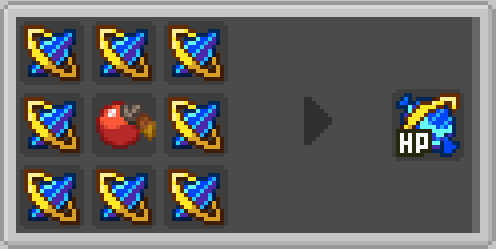
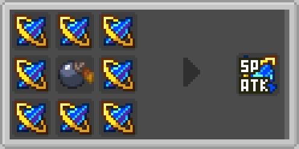

# Super Candy Recipes

Super IV Candies provide targeted enhancement to specific Pokémon IV stats. These advanced candies require more resources but offer precise control over stat improvement.

## Recipe Overview

| Recipe Type | Grid Size | Result | Purpose |
|-------------|-----------|--------|---------|
| Super Candy | 3x3 | Targeted IV Candy | Enhances a specific IV stat |

## Super Candy Recipe

Creates an IV Candy that specifically enhances a chosen IV stat.

### Pattern
```
[S] [S] [S]
[S] [I] [S]
[S] [S] [S]
```

### Requirements
- **8 Identical IV Shards**: Must be the same type and species/elemental type
- **1 Stat Item**: Determines which IV stat to target
- **Positions**: Shards surround the center item, stat item in center (slot 4)

### Stat Items

These items determine which IV stat the resulting candy will enhance:

| Item | Target IV Stat | Description |
|------|----------------|-------------|
|  **Red Apricorn** | HP | Health Points |
|  **Yellow Apricorn** | Attack | Physical Attack Power |
|  **Green Apricorn** | Defense | Physical Defense |
|  **Black Apricorn** | Special Attack | Special Attack Power |
|  **Blue Apricorn** | Special Defense | Special Defense |
|  **White Apricorn** | Speed | Speed/Agility |

### Examples

#### HP Enhancement Candy
```
[Pikachu Shard] [Pikachu Shard] [Pikachu Shard]
[Pikachu Shard] [Red Apricorn] [Pikachu Shard]
[Pikachu Shard] [Pikachu Shard] [Pikachu Shard]
```
**Result**: Pikachu IV Candy [HP]

#### Attack Enhancement Candy
```
[Fire Shard] [Fire Shard] [Fire Shard]
[Fire Shard] [Yellow Apricorn] [Fire Shard]
[Fire Shard] [Fire Shard] [Fire Shard]
```
**Result**: Fire IV Candy [Attack]

#### Speed Enhancement Candy
```
[Legendary Shard] [Legendary Shard] [Legendary Shard]
[Legendary Shard] [White Apricorn] [Legendary Shard]
[Legendary Shard] [Legendary Shard] [Legendary Shard]
```
**Result**: Legendary IV Candy [Speed]

#### Defense Enhancement Candy


#### Special Attack Enhancement Candy


## Recipe Mechanics

### Validation Rules

#### Super Candy Recipe Validation
1. **Surround Pattern**: All 8 outer slots must contain identical shards
2. **Center Item**: Must be one of the valid stat items
3. **Shard Matching**: All 8 shards must be identical
4. **Valid Items**: Only recognized stat items trigger the recipe

### Crafting Behavior

#### Result Generation
- **Shard Data Transfer**: The resulting candy inherits data from the input shards
- **Stat Assignment**: For super candies, the center item determines the target stat
- **Naming**: Candy names reflect their source and target stat
- **Model Data**: Visual appearance matches the shard type and target stat

#### Error Handling
- **Invalid Patterns**: Recipes fail silently if pattern requirements aren't met
- **Mixed Shards**: Different shard types cannot be mixed in the same recipe
- **Wrong Items**: Non-stat items in the center slot prevent super candy creation

## Advanced Crafting

### Resource Planning
1. **Stat Priority**: Identify which stats your Pokémon need most
2. **Shard Conservation**: Super candies require 8 shards vs 3 for basic candies
3. **Apricorn Collection**: Gather the appropriate colored apricorns for your target stats

### Crafting Strategy
1. **Targeted Enhancement**: Use super candies when you need specific stat improvements
2. **Competitive Building**: Essential for creating competitively viable Pokémon
3. **Min-Max Optimization**: Perfect for fine-tuning already strong Pokémon

### Stat Item Acquisition
- **Red Apricorns**: Often found near berry trees
- **Yellow Apricorns**: Common in grassland biomes
- **Green Apricorns**: Frequently found in forest areas
- **Black Apricorns**: Rare, found in specific biomes
- **Blue Apricorns**: Often near water sources
- **White Apricorns**: Found in mountainous regions

## Integration

### Crafting Book
- **Category**: Recipes appear in the "Miscellaneous" category
- **Discovery**: Recipes are automatically unlocked when you obtain the required items
- **Preview**: Recipe book shows the general pattern and requirements

### Mod Compatibility
- **JEI/REI Support**: Recipes are compatible with recipe viewing mods
- **Custom Recipe Type**: Uses mod-specific recipe serializers
- **Server Sync**: Recipes work correctly in multiplayer environments

## Troubleshooting

### Common Crafting Issues

**"Recipe not working"**
- Verify all 8 shards are identical
- Check that the stat item is in the center position
- Ensure the crafting pattern matches exactly

**"Wrong candy type created"**
- Confirm you're using the right stat item for the desired enhancement
- Verify the center item is a valid apricorn
- Check that no extra items are in the grid

**"No result in crafting grid"**
- Make sure you're using IV Shards from this mod
- Verify you have exactly 8 shards of the same type
- Check that the stat item is recognized by the mod

### Debug Information
Use the debug interaction (right-click with items) to verify:
- Shard data components are correct
- Stat items have proper identifiers
- All 8 shards match exactly

---

**Previous**: Learn about [Basic Candy Recipes](basic-recipes.md) for random stat enhancement.
