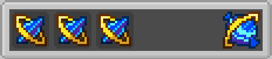

# Crafting Recipes

The Cobblemon IV Candy mod features two main crafting recipes: **Basic Candy Recipe** for random IV enhancement and **Super Candy Recipe** for targeted IV enhancement.

## Recipe Overview

| Recipe Type | Grid Size | Result | Purpose |
|-------------|-----------|--------|---------|
| Basic Candy | 3x3 | Random IV Candy | Enhances a random non-maxed IV stat |
| Super Candy | 3x3 | Targeted IV Candy | Enhances a specific IV stat |

## Basic Candy Recipe

Creates an IV Candy that randomly enhances one of the Pokémon's non-maxed IV stats.

### Pattern
```
[S] [S] [S]
[ ] [ ] [ ]
[ ] [ ] [ ]
```

### Requirements
- **3 Identical IV Shards**: Must be the same type and species/elemental type
- **Positions**: Top row (slots 0, 1, 2) of a 3x3 crafting grid
- **Empty Slots**: All other positions must be empty

### Shard Compatibility
The three shards must match exactly:
- **Species Shards**: Same Pokémon species
- **Elemental Shards**: Same elemental type
- **Category Shards**: Same category (Legendary, Mythical, etc.)

### Examples

#### Species Candy Crafting


#### Elemental Type Candy Crafting


#### Legendary Random Candy Crafting


#### Mythical Random Candy Crafting


#### Ultra Beast Random Candy Crafting


#### Paradox Candy Crafting


## Super Candy Recipe

Creates an IV Candy that specifically enhances a chosen IV stat.

### Pattern
```
[S] [S] [S]
[S] [I] [S]
[S] [S] [S]
```

### Requirements
- **8 Identical IV Shards**: Must be the same type and species/elemental type
- **1 Stat Item**: Determines which IV stat to target
- **Positions**: Shards surround the center item, stat item in center (slot 4)

### Stat Items

These items determine which IV stat the resulting candy will enhance:

| Item | Target IV Stat | Description |
|------|----------------|-------------|
|  **Red Apricorn** | HP | Health Points |
|  **Yellow Apricorn** | Attack | Physical Attack Power |
|  **Green Apricorn** | Defense | Physical Defense |
|  **Black Apricorn** | Special Attack | Special Attack Power |
|  **Blue Apricorn** | Special Defense | Special Defense |
|  **White Apricorn** | Speed | Speed/Agility |

### Examples

#### HP Enhancement Candy
```
[Pikachu Shard] [Pikachu Shard] [Pikachu Shard]
[Pikachu Shard] [Red Apricorn] [Pikachu Shard]
[Pikachu Shard] [Pikachu Shard] [Pikachu Shard]
```
**Result**: Pikachu IV Candy [HP]

#### Attack Enhancement Candy
```
[Fire Shard] [Fire Shard] [Fire Shard]
[Fire Shard] [Yellow Apricorn] [Fire Shard]
[Fire Shard] [Fire Shard] [Fire Shard]
```
**Result**: Fire IV Candy [Attack]

#### Speed Enhancement Candy
```
[Legendary Shard] [Legendary Shard] [Legendary Shard]
[Legendary Shard] [White Apricorn] [Legendary Shard]
[Legendary Shard] [Legendary Shard] [Legendary Shard]
```
**Result**: Legendary IV Candy [Speed]

## Recipe Mechanics

### Validation Rules

#### Basic Candy Recipe Validation
1. **Exact Pattern**: Only the first three slots (top row) should contain shards
2. **Shard Matching**: All three shards must be identical
3. **Empty Slots**: Remaining slots must be completely empty
4. **Valid Shards**: Only mod-specific IV Shards are accepted

#### Super Candy Recipe Validation
1. **Surround Pattern**: All 8 outer slots must contain identical shards
2. **Center Item**: Must be one of the valid stat items
3. **Shard Matching**: All 8 shards must be identical
4. **Valid Items**: Only recognized stat items trigger the recipe

### Crafting Behavior

#### Result Generation
- **Shard Data Transfer**: The resulting candy inherits data from the input shards
- **Stat Assignment**: For super candies, the center item determines the target stat
- **Naming**: Candy names reflect their source and target stat
- **Model Data**: Visual appearance matches the shard type and target stat

#### Error Handling
- **Invalid Patterns**: Recipes fail silently if pattern requirements aren't met
- **Mixed Shards**: Different shard types cannot be mixed in the same recipe
- **Wrong Items**: Non-stat items in the center slot prevent super candy creation

## Advanced Crafting Tips

### Shard Collection Strategy
1. **Focus on Common Species**: Collect shards from frequently encountered Pokémon
2. **Type Diversity**: Gather elemental shards for versatility
3. **Rare Categories**: Save Legendary/Mythical shards for important Pokémon

### Recipe Planning
1. **Stat Priority**: Identify which stats your Pokémon need most
2. **Candy Type Selection**: Choose between species-specific and type-specific candies
3. **Resource Management**: Balance between random and targeted candies

### Bulk Crafting
1. **Shard Organization**: Sort shards by type before crafting sessions
2. **Stat Item Preparation**: Keep common stat items readily available
3. **Crafting Table Setup**: Use a dedicated crafting area for efficiency

## Recipe Integration

### Crafting Book
- **Category**: Recipes appear in the "Miscellaneous" category
- **Discovery**: Recipes are automatically unlocked when you obtain the required items
- **Preview**: Recipe book shows the general pattern and requirements

### Mod Compatibility
- **JEI/REI Support**: Recipes are compatible with recipe viewing mods
- **Custom Recipe Type**: Uses mod-specific recipe serializers
- **Server Sync**: Recipes work correctly in multiplayer environments

## Troubleshooting

### Common Crafting Issues

**"Recipe not working"**
- Verify shard types match exactly
- Check that pattern is correct
- Ensure no extra items are in the grid

**"Wrong candy type created"**
- Confirm you're using the right stat item for super candies
- Check that all shards are identical
- Verify the crafting pattern matches the recipe

**"No result in crafting grid"**
- Make sure you're using IV Shards from this mod
- Check that shards aren't damaged or modified
- Verify all required positions are filled correctly

### Debug Information
Use the debug interaction (right-click with items) to verify:
- Shard data components are correct
- Items have proper mod identifiers
- Data values match expected patterns
